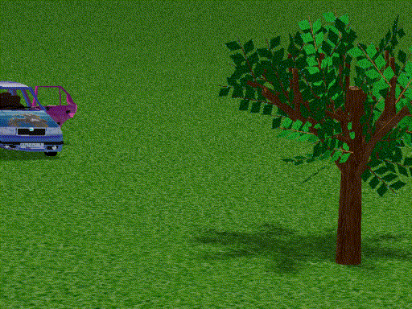

    Controls:

        forward: W
        back: S
        left: A
        right: D

        Change camera view: H
    	Slow motion toggle: X
    	Pause: P
        Change vehicle: V
    	Add vehicle: R

        second vehicle controls:
            forward: I
            back: K
            left: J
            right: L

Note: On macOS (intel), the program might segfault on startup, it must be ran in the terminal.